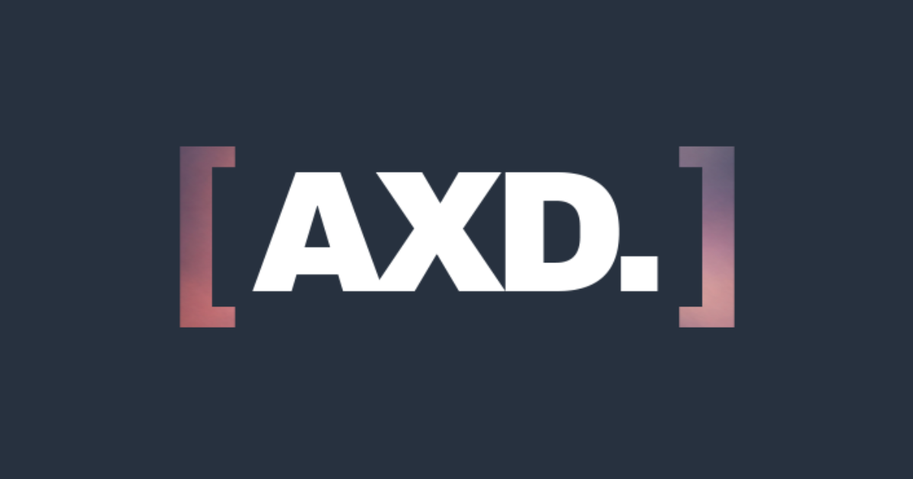

# [AXD.] — Mind of AXD

**Andre Weiss · Photographer with a researcher's mind.**

[Visit mindofaxd.com](https://mindofaxd.com/) · [Editing guide](docs/EDITING.md) · [Deployment & rollback](docs/DEPLOYMENT.md)



A photography portfolio built around a stack of prints, measured color palettes, selected collaborations, and a personal introduction. Three horizontally navigable chapters connect the photographs, project stories, and About & Say Hello.

## What's inside

- Five hero photographs with palettes from **Perceptual Palette Drift**.
- Project previews, complete stories, photo galleries, and expanded images.
- A palette-to-brackets intro and a spelling name animation, with reduced-motion and pause support.
- Responsive desktop and mobile layouts, keyboard navigation, and native dialogs.
- Clean web images with watermarked copies available through **Take a copy**.

Plain HTML, CSS, and JavaScript. No framework or package installation is required to edit, preview, or build.

## Edit content

| Change | File |
| --- | --- |
| Project dates, descriptions, collaborators, photos, and links | [`site/assets/data/projects.js`](site/assets/data/projects.js) |
| Hero photos and measured palettes | [`site/assets/data/photographs.js`](site/assets/data/photographs.js) |
| About text, portrait, contact links, background | [`site/index.html`](site/index.html) |
| Layout, spacing, responsive overrides | [`site/layout.css`](site/layout.css) |
| Fonts, base styles, core visual treatment | [`site/styles.css`](site/styles.css) |

For the visible project copy, edit `caseStudy.title`, `caseStudy.summary`, `caseStudy.body`, and `caseStudy.facts`. Change `year` for the date and `caseStudy.links` for external links. The [editing guide](docs/EDITING.md) describes each field.

## Preview locally

From the repository root:

```sh
python3 -m http.server 6767 --bind 0.0.0.0 --directory site
```

Open **http://localhost:6767/**. For a phone on the same Wi-Fi, use `http://YOUR-MAC-IP:6767/`. On a Mac, `ipconfig getifaddr en0` usually returns the Wi-Fi address. If the port is occupied, use a different port or the already-running server.

## Build and publish

```sh
node site/build.mjs
```

The output is `site/dist/`. The build generates production metadata and adds content hashes to script and stylesheet URLs so edited content refreshes correctly.

**Cloudflare Workers Builds** deploys the `main` branch of this repository to the existing `axd-site` Worker. `wrangler.jsonc` runs the build and serves only `site/dist/`. Push a reviewed commit to `main` to publish. See [deployment & rollback](docs/DEPLOYMENT.md).

## Repository layout

```text
site/                  Editable website source
  assets/data/         Project stories and hero photographs
  assets/fonts/        Local fonts and their licenses
  assets/images/       Optimized web photographs and logo assets
  dist/                Generated public output; ignored by Git
docs/                  Editing, deployment, and palette provenance
wrangler.jsonc         Existing Cloudflare Worker + build configuration
```

The old portfolio is preserved in Git under **`pre-redesign-2026-09-19`**. On the original working machine, `.local-archive/` also retains the old site, raw inputs, image-processing tools, and a pre-launch redesign snapshot. It is ignored and never deployed.

## Images and credits

Photography and site content © Andre Weiss. Font licenses are included under `site/assets/fonts/`. Palette origins are recorded in [`docs/palette-provenance.json`](docs/palette-provenance.json).

Displayed photographs are resized web copies. Download watermarking does not prevent screenshots or extraction of displayed images.
